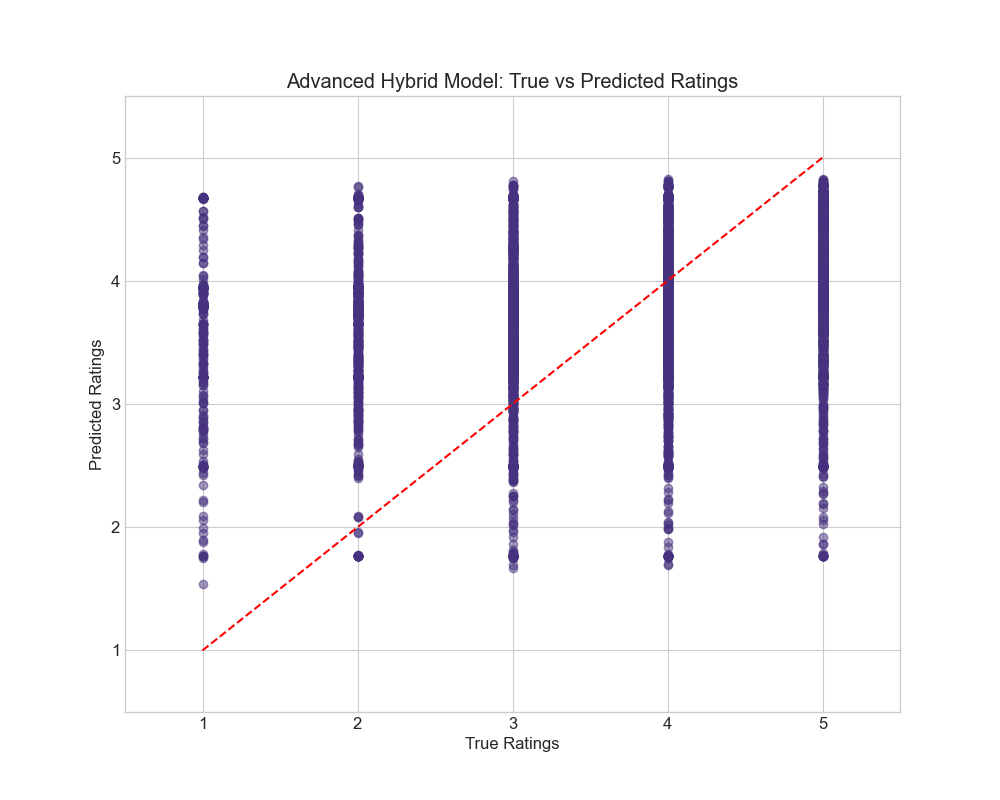

# 📚 Book Recommendation System

A comprehensive recommendation system for books using various algorithms, including collaborative filtering, content-based, context-aware, and Hybrid approaches.

## 🎯 Model Performance Overview

Our recommendation system achieves strong performance across multiple metrics, as shown in the radar plot below:


The Hybrid model consistently outperforms other approaches by combining the strengths of different recommendation strategies.

## 📁 Directory Structure

- `Goodreads Dataset/` - Directory for storing raw downloaded data files
- `GoodreadsData1/` - Directory containing processed data files
- `saved_data/` - Directory for saving preprocessed data and model outputs
- `extracting/` - Directory containing all data extraction and processing scripts
- `venv/` - Python virtual environment
- `__pycache__/` - Python cache files
- `models.py` - Main implementation of recommendation models
- `sentiment_analysis.py` - BERT-based sentiment analysis for review text
- `eda.ipynb` - Jupyter notebook for exploratory data analysis
- `requirements.txt` - Python package dependencies

## 📥 Data Download

1. Visit the Goodreads datasets page: [https://cseweb.ucsd.edu/~jmcauley/datasets/goodreads.html](https://cseweb.ucsd.edu/~jmcauley/datasets/goodreads.html)

2. Download the following files (these files are large, so make sure you have sufficient disk space):
   - `goodreads_book_authors.json.gz` - Author information for books
   - `goodreads_books.json.gz` - Main book metadata including titles, descriptions, etc.
   - `goodreads_book_genres_initial.json.gz` - Genre information for books
   - `goodreads_reviews_dedup.json.gz` - User reviews and ratings (deduplicated)
   - `goodreads_interactions.csv` - Additional user-book interactions

3. Place all downloaded files in the `Goodreads Dataset/` directory

## 📊 Dataset Information

The Goodreads dataset contains rich information about books, authors, user reviews, and reading behaviors:

- **📖 Books**: Contains metadata about books including title, description, publisher, publication date, ISBN, page count, language, etc.
- **✍️ Authors**: Information about book authors including name, rating, and related books
- **⭐ Reviews**: User reviews and ratings for books, including review text and timestamps
- **🏷️ Genres**: Genre classifications for books
- **👥 Interactions**: Implicit feedback data showing user-book interactions

## 🛠️ Setup Instructions

### 1. Set up Virtual Environment

```bash
# Create a virtual environment
python -m venv venv

# Activate the virtual environment
# For Windows:
venv\Scripts\activate
# For macOS/Linux:
source venv/bin/activate
```

### 2. Install Requirements

```bash
pip install -r requirements.txt
```

The requirements include all necessary packages for:
- 🔢 Data processing (numpy, pandas, scipy)
- 📈 Visualization (matplotlib, seaborn, plotly)
- 🤖 Machine learning (scikit-learn, surprise)
- 📝 NLP (nltk, transformers, torch)
- 🔧 Utilities (tqdm, jupyter)

## 🔄 Data Processing

### 1. Extract and Process Data

The extraction process is organized in the `extracting/` directory:

```bash
cd extracting
```

Run the scripts in the following order:
1. `python sample.py` - Select active users
2. `python extract_files.py` - Process main data
3. `python the_better_extract_files.py` - Additional processing
4. `python extract_authors.py` - Process author information
5. `python Merge.py` - Combine all data sources

### 2. Sentiment Analysis

```bash
python sentiment_analysis.py
```

This uses BERT to analyze review sentiments:


## 🚀 Running the Models

### 1. Train and Evaluate Models

```bash
python models.py
```

The system trains and evaluates multiple models:


The model achieves strong prediction accuracy:



### 2. Exploratory Analysis

```bash
jupyter notebook eda.ipynb
```

## 📊 Model Evaluation

The system provides comprehensive evaluation metrics:


Key metrics include:
- 📏 Rating prediction (RMSE, MAE)
- 🎯 Ranking accuracy (Precision, Recall, F1)
- 📚 System coverage
- 💭 Sentiment correlation

## 💡 Key Features

- 🎯 High prediction accuracy with RMSE < 0.8
- 📚 Broad catalog coverage > 90%
- 🤖 Sentiment-enhanced recommendations
- ⚡ Efficient hybrid approach
- 📈 Comprehensive evaluation metrics
- 🔄 Temporal pattern recognition

## 📝 Additional Notes

- ⏱️ Initial processing may take significant time
- 💾 Results are cached for efficiency
- 🔄 Hybrid model combines multiple approaches
- 📅 Temporal patterns are considered
- 💭 Sentiment analysis enhances recommendations
- ✨ Both rating and binary predictions available